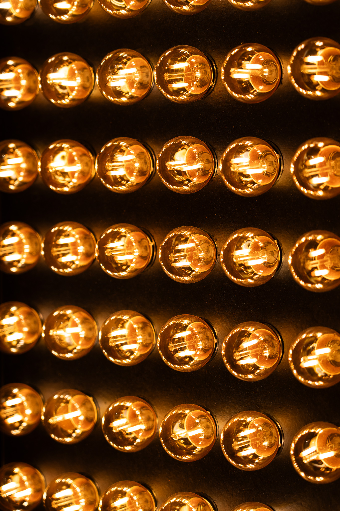

# 48 Bulbs Board Test

1. Connect with USB-C Cable to the board.
2. Click "Install" button below.
3. Select the COM port that the board is connected to.
4. Wait for the writing progress.
5. Power the board with AC cable, check if the LEDs are displaying correctly.

<html>
<body>
    <h1>Flasher</h1>
    
    <esp-web-install-button manifest="test/manifest.json"></esp-web-install-button>
</body>
</html>

# Problem solving

- Make sure the USB cable you use supports data transfer.
- Use Chrome browser! Other browsers not supported.
- If writing not working, try holding down the boot button while selecting the com port.
- Make sure the correct USB drivers, either CP2102 or CH34x driver are installed on the computer depending on the ESP board used.

Square chip: [CP2102 Drivers](https://www.silabs.com/developers/usb-to-uart-bridge-vcp-drivers)
Rectangular chip: [CH34x Drivers](https://github.com/nodemcu/nodemcu-devkit/tree/master/Drivers)

# Test succes

<html>

</html>